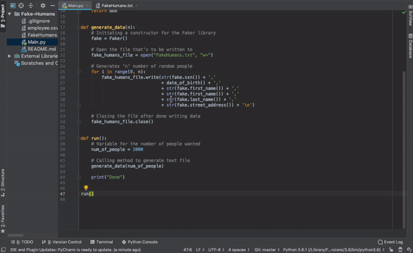

# Fake-Humans
Python code that generates tuples of fake humans for use within a database (CSC 471 project)

  

## Authors

* **Alejandro Penaloza** - [Github](https://github.com/apenaloza7)

## Acknowledgments

* Google
* Stack Overflow
* Python Faker Library

